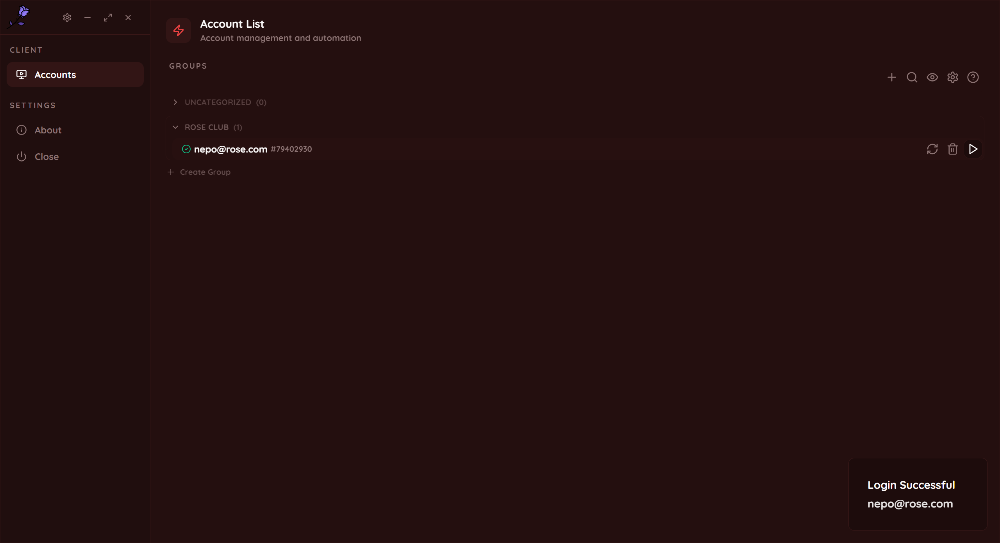
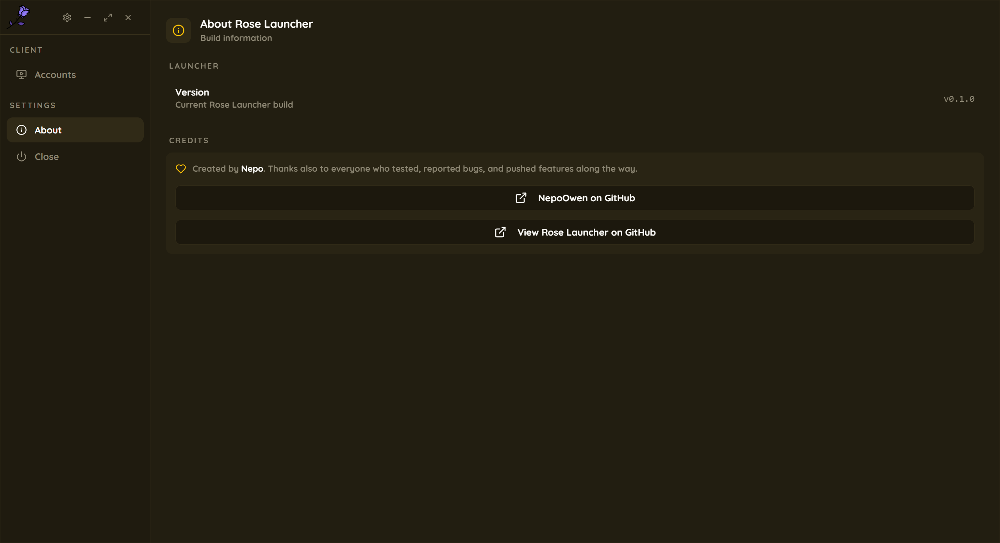
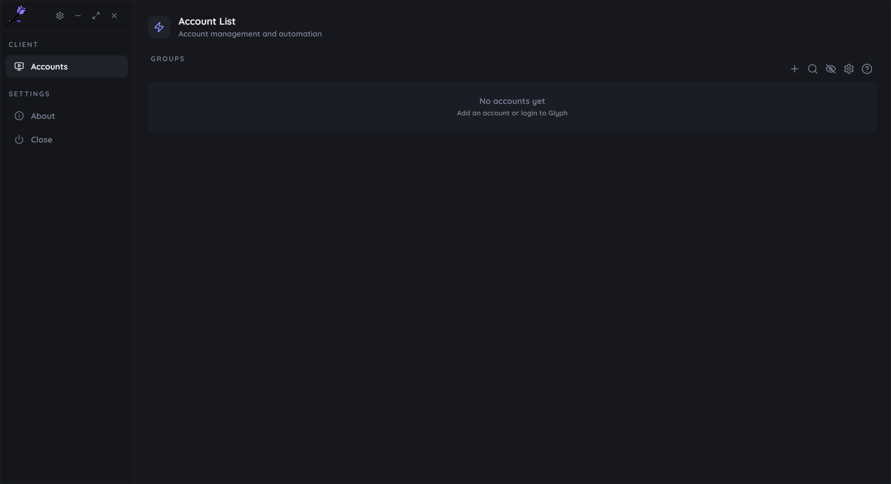
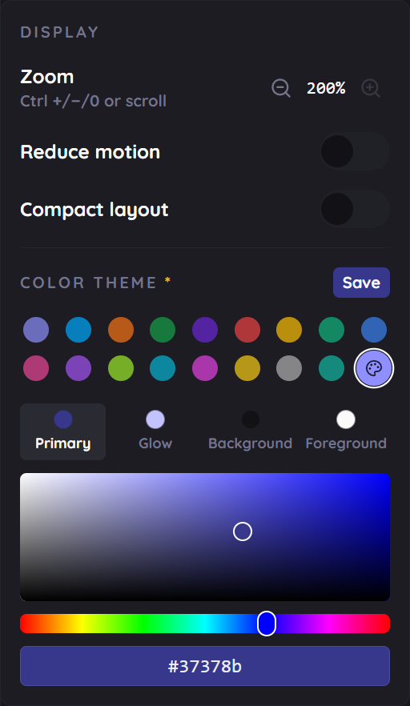

# Rose Launcher

A lightweight, fully local [Trove](https://www.trionworlds.com/trove/) launcher built with Tauri + React.

Rose Launcher manages Glyph/Trion accounts, keeps their login sessions alive, launches the game directly with a saved session, and can check for and install Trove updates (Live and PTS, tracked independently) - all without a backend server. Everything is stored locally on your machine.

> **Note on Glyph access:** this project talks to Glyph/Trion's own login and update endpoints to authenticate accounts and launch the game.

> **Disclaimer:** Rose Launcher is an independent, fan-made project. It is **not affiliated with, endorsed by, or sponsored by gamigo group, Trion Worlds, or Glyph**. Trove, Glyph, and all related trademarks are property of their respective owners.

## Screenshots






## Features

- **Multi-account management** - add, group (drag & drop, Discord-style categories), search, and switch between Glyph accounts
- **Saved sessions** - log in once; Rose Launcher keeps the session alive in the background and reuses it on launch
- **One-click launch** - start Trove directly with a saved session, no manual Glyph login each time
- **Live + PTS updates** - checks both channels independently against Trion's update CDN, with a lowkey non-blocking notification (pause/resume/cancel a download in progress, cleanly - nothing touches your install until every file is verified)
- **Fresh installs** - no Trove install yet? Download it straight from the launcher
- **Fully local** - no backend, no telemetry; account data is stored on disk next to the app, obfuscated at rest
- **Themeable UI** - pick a color preset or build a fully custom theme with a built-in color picker
- **Accessibility** - adjustable UI zoom, reduce-motion, and compact layout options
- **In-app find** - quick find-on-page search (F3), since there's no browser chrome to Ctrl+F in

## Getting started

### Prerequisites

- [Node.js](https://nodejs.org/) (LTS)
- [Rust](https://www.rust-lang.org/tools/install) (stable toolchain)
- The [Tauri prerequisites](https://v2.tauri.app/start/prerequisites/) for your platform (Windows: MSVC build tools + WebView2)

### Setup

```sh
git clone https://github.com/NepoOwen/rose-launcher.git
cd rose-launcher
npm install
```

### Run in development

```sh
npm run tauri:dev
```

### Build

```sh
npm run tauri:build
```

The built app and installer will be under `src-tauri/target/release/bundle`.

## Tech stack

- [Tauri 2](https://v2.tauri.app/) (Rust backend)
- React + TypeScript
- Vite
- Tailwind CSS + shadcn/ui

## License

[MIT](LICENSE) - created by [Nepo](https://github.com/NepoOwen).
